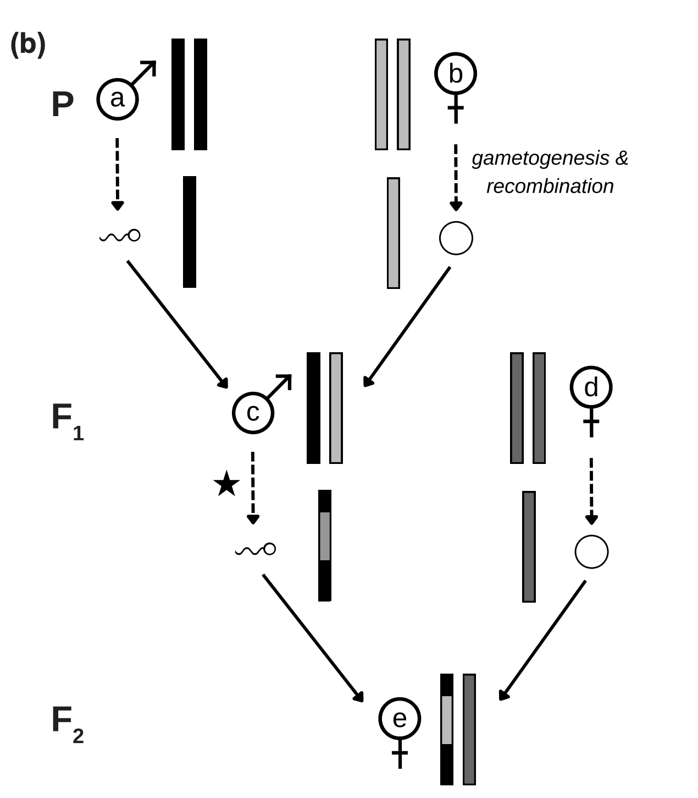
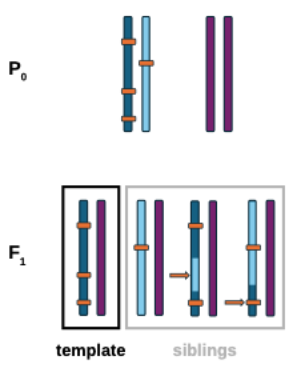

## A pedigree-based map of crossovers and non-crossovers in aye-ayes (*Daubentonia madagascariensis*)

Accompanying code for Cyril J. Versoza*, Audald Lloret-Villas*, Jeffrey D. Jensen, Susanne P. Pfeifer. 2025. [A pedigree-based map of crossovers and non-crossovers in aye-ayes (*Daubentonia madagascariensis*)](https://doi.org/10.1093/gbe/evaf072). `Genome Biology and Evolution:evaf072`.

### Code

[`Snakemake`](https://snakemake.readthedocs.io/en/stable/) workflows are provided for the three processes described in the manuscript and in the sections below: variant filtering, pedigree-based approach and family-based approach.

#### `Snakemake` execution

The [step-by-step document](Step-by-step.md) contains the relevant information to call and implement the `Snakemake` pipelines with standard input files.

#### Variant filtering

The [variant filtering workflow](Snakepit/Variant_filtering/) defines how the autosomal variants were processed and filtered to obtain a high-confidence `SNP` set. The rules included in this workflow are:

- `raw_indel_VCFs`, retrieves the normalized `INDELs` (this is, left-aligns the insertions and deletions for a consistent representation, and splits multiallelic sites into biallelic records) from the raw genotyped `VCF` with `bcftools norm` and `bcftools view`.
- `bam_coverage`, calculates the sequencing coverage of the `BAM` files with `samtools coverage`.
- `vcf_prep`, concatenates the genotype per-chromosome autosomal `VCF` files with `bcftools concat` and calls segregating sites with `bcftools view`.
    - The custom script [`vcf_autosomes.sh`](Snakepit/Variant_filtering/scripts/vcf_autosomes.sh) is used to create the list of autosomes required by `bcftools concat`.
- `mask_filter`, provided a `.bed` file with the coordinates of repetitive regions, `bcftools view` is used to mask the `VCF` file.
- `dp_table`, extracts the read depth (`DP`) in each position and formats the output as a table with `bcftools query`
- `dp_filter`, filters out the variants that have a `DP` less than half or more than twice the average `DP` for that particular sample.
    - The custom script [`DP.sh`](Snakepit/Variant_filtering/scripts/DP.sh) uses `bash` code and `bcftools view` to perform such filtering.
- `gq_filter`, filters out the variants with a genotype quality (`GQ`) lower than `30`, with `bcftools view`.
- `het_filter`, filters out the variants wih an excess of heterozygosity (defined as a `p-value` of `0.01`) with the `bcftools` plug-in `+fill-tags` and `bcftools view`.
- `men_filter`, provded a `.ped` file with pedigree information, it filters out the variants that violate the patterns expected by Mendelian inheritance, with the `bcftools` plugin `+mendelian2`.
- `auto_split`, splits the `VCF` files into autosome-specific `VCF` files, with `bcftools view`.
- `snp_cluster_filter`, removes cluster of variants (defined as `≥ 3 SNPs` within a `10 bp` window) from the autosomal `VCF` files.
    - The custom script [`SNP_clusters.py`](Snakepit/Variant_filtering/scripts/SNP_clusters.py), developed with `pysam` is used for such purpose.
- `indel_filter`, removes variants located within `10 bp` of an insertion/deletion (`INDEL`).
    - The custom script [`Indels.py`](Snakepit/Variant_filtering/scripts/Indels.py), developed with `pysam` is used for such purpose.
- `chop_ends`, removes variants located within `2 Mb` from the autosome ends.
    - The custom script [`Chop_ends.py`](Snakepit/Variant_filtering/scripts/Chop_ends.py), developed with `pysam` is used for such purpose.

#### Pedigree-based approach

Phase-informative markers are identified from the high-confidence `SNPs` detected above by applying a [pedigree-based approach](Snakepit/Pedigree_approach/) (for a schematic of the workflow, see the Figure below, included in [Versoza, Weiss *et al.* (2024)](https://academic.oup.com/gbe/article/16/1/evad223/7459156)) with the following rules:

- `ped_split`, generates the six three-generation pedigree-specific sets of segregating `SNPs` with `bcftools view`.
- `supreads_filter`, keeps only the positions supported by more than `25%` but less than `75%` of the mapped reads with `bcftools view`.
- `ped_F1_het`, keeps only the positions where the `F1` individual is heterozygous, with `bcftools view`
- `ped_F0_diff`, keeps only the positions where the `F0` individuals (parents) exhibited non-identical genotypes, with a combination of `bcftools view` and `bcftools sort`.
- `partner_F2_hom_ped`, keeps only the positions where either the `F1`'s partner or their joint `F2` offspring was homozygous. The variants resulting from this step are considered phase-informative markers (see Figure underneath this list).
- `phase_script`, phases the phase-informative markers. This is, it indicates whether the variants have a grandpaternal (`gpat`) or grandmaternal (`gpat`) origin. A combination of `bcftools query` and `bash` commands indentify the origin and formats the calls.
- `ph_events`, simplifies and formats the output indicating the phase (`gpat` or `gpat`), the coordinates, the `REF`/`ALT` alleles and the genotype of each member of the pedigree for the phase-informative markers.
    - The custom script [`pedigrees.py`](Snakepit/Pedigree_approach/scripts/pedigrees.py), developed with `pandas` is used for such purpose.
- `clean_blocks`, detects breakpoints (changes of phase) in the phase-informative markers, removes short regions (`5 Kb`) with multiple changes of phase, identifies breakpoints encompassing more than one phase-informative marker, re-phases the markers and midpoint values and resolution tract of the events.
    - The custom script [`Clean_blocks.py`](Snakepit/Pedigree_approach/scripts/Clean_blocks.py), developed with `pandas` is used for such purpose.
    - The resulting filtered files are then subject to a visual exploration to identify crossover (`CO`) and noncrossover (`NCOs`) events.

  

#### Family-based approach

Phase-informative markers are identified from the high-confidence `SNPs` detected above by applying a [family-based approach](Snakepit/Family_approach/) (for a schematic of the workflow, see the Figure below, included in [Versoza, Lloret-Villas *et al.* (2025)](https://www.biorxiv.org/content/10.1101/2024.11.08.622675v1), following the methodology outlined in [Coop *et al.* (2008)](https://pubmed.ncbi.nlm.nih.gov/18239090/)) with the following rules:

- `fam_split`, generates the three two-generation nuclear family-specific sets of segregating `SNPs` with `bcftools view`.
- `supreads_filter`, keeps only the positions supported by more than `25%` but less than `75%` of the mapped reads with `bcftools view`.
- `inf_markers`, identifies and separates maternally phase-informative markers (at which the dam was heterozygous and the sire homozygous) and paternally phase-informative markers (at which the sire was heterozygous and the dam homozygous) with a combination of `bcftools view` and `bcftools query`.
- `ph_events`, simplifies and conditionally formats the output depending on the number of offspring. It indicates the origin of transmitted alleles (`maternal` or `paternal`), the coordinates, the `REF`/`ALT` alleles and the genotype of each member of the family for the phase-informative markers, as well as the phase of the offspring in comparison to the template offspring.
    - The custom script [`families.py`](Snakepit/Family_approach/scripts/families.py), developed with `pandas` is used for such purpose.
- `clean_blocks`, detects breakpoints (changes of phase) in the phase-informative markers, removes short regions (`5 Kb`) with multiple changes of phase, identifies breakpoints encompassing more than one phase-informative marker, re-phases the markers and midpoint values and resolution tract of the events.
    - The custom script [`Clean_blocks.py`](Snakepit/Family_approach/scripts/Clean_blocks.py), developed with `pandas` is used for such purpose.
    - The resulting filtered files are then subject to a visual exploration to identify crossover (`CO`) and noncrossover (`NCOs`) events.

  

#### Software / Tools

All the software and tools used during for the development of the `Snakemake` workflow and accompanying scripts can be downloaded and installed via [`conda`/`mamba`](https://anaconda.org/anaconda/conda). These are the links to package recipes and versions used:

- [`Snakemake (v.7.32.4)`](https://anaconda.org/bioconda/snakemake)
- [`bcftools (v.1.19)`](https://anaconda.org/bioconda/bcftools)
- [`Samtools (v.1.19)`](https://anaconda.org/bioconda/samtools)
- [`pysam (v.0.22.1`](https://anaconda.org/bioconda/pysam)
- [`pandas (v.2.2.0)`](https://anaconda.org/conda-forge/pandas)